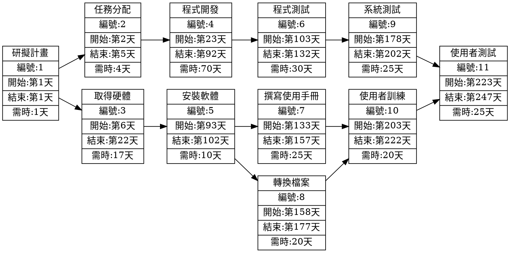

```graphviz
digraph {
	node[shape=record];
	rankdir="LR";
    no1 [label = "研擬計畫 | 編號:1 | 開始:第1天 | 結束:第1天 | 需時:1天"]
    no2 [label = "任務分配 | 編號:2 | 開始:第2天 | 結束:第5天 | 需時:4天"]  
    no3 [label = "取得硬體 | 編號:3 | 開始:第6天 | 結束:第22天 | 需時:17天"]
     no1->no2
     no1->no3 
     {rank=same;no2 no3}
    no4 [label = "程式開發 | 編號:4 | 開始:第23天 | 結束:第92天 | 需時:70天"]
     no2->no4 
    no5 [label = "安裝軟體 | 編號:5 | 開始:第93天 | 結束:第102天 | 需時:10天"]
     no3->no5 
    no6 [label = "程式測試 | 編號:6 | 開始:第103天 | 結束:第132天 | 需時:30天"]
     no4->no6 
    no7 [label = "撰寫使用手冊 | 編號:7 | 開始:第133天 | 結束:第157天 | 需時:25天"]
    no8 [label = "轉換檔案 | 編號:8 | 開始:第158天 | 結束:第177天 | 需時:20天"]
     no5->no7
     no5->no8 
     {rank=same;no7 no8}
    no9 [label = "系統測試 | 編號:9 | 開始:第178天 | 結束:第202天 | 需時:25天"]
    no6->no9
    no10 [label = "使用者訓練 | 編號:10 | 開始:第203天 | 結束:第222天 | 需時:20天"]
    no7->no10
    no8->no10
    
    no11 [label = "使用者測試 | 編號:11 | 開始:第223天 | 結束:第247天 | 需時:25天"]
    no9->no11
    no10->no11
}
```
